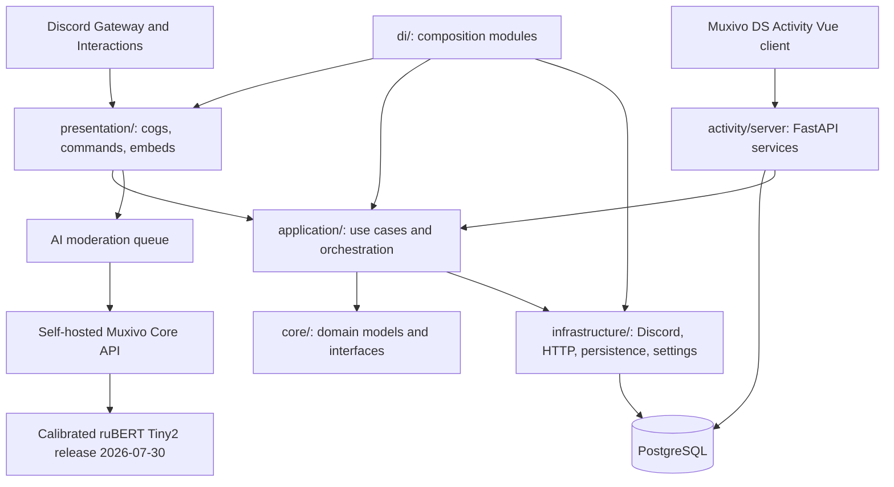

# Muxivo Discord Architecture

## System overview

Muxivo Discord is a Discord bot plus a Muxivo DS Activity administration surface. It is
designed around dependency inversion: Discord events and HTTP endpoints are
adapters, while application services and domain interfaces contain the business
rules. PostgreSQL is the production persistence layer.

## Repository layout

| Directory | Responsibility |
| --- | --- |
| `presentation/` | disnake cogs, event listeners, slash commands, Discord-facing embeds and views. |
| `application/` | use cases, policy orchestration, queues, and cross-feature services. |
| `core/` | domain entities, value objects, repository ports, and service interfaces. |
| `infrastructure/` | PostgreSQL repositories, Discord/HTTP clients, settings, logging, and external providers. |
| `di/` | concrete composition and dependency wiring. |
| `activity/server/` | Activity API, OAuth/access checks, panel services, audit and RBAC logic. |
| `activity/client/` | Vue 3 Muxivo DS Activity user interface. |
| `alembic/` | PostgreSQL schema migrations. |
| `scripts/` | operational, migration, deployment, and maintenance utilities. |
| `tests/` | unit, integration, and end-to-end coverage. |

## Runtime entry points

- `main.py` starts the Discord bot and its dependency graph.
- The Activity server serves the API consumed by the Vue client; the production
  client proxies `/api/...` requests to that server on the same origin.
- Alembic owns schema changes. Runtime services and repositories must not issue
  schema DDL.
- Muxivo Core is an external local service. It has its own process, database
  schema, health endpoint, deployment lifecycle, and model artefacts.

## AI moderation flow

1. `AiModerationCog` handles a Discord create or edit event only when the
   channel is enabled for AI moderation.
2. It builds `AiModerationRequest` with bounded reply context, bounded author
   history, account/guild membership signals, and moderation history. Discord
   snowflakes remain strings.
3. `AiModerationQueue` provides bounded work and `AiModeratorApiClient` calls
   `/moderation/messages` or `/moderation/media`. The media route is selected
   only for supported Discord image attachments.
4. The bot never downloads attachment bytes. It sends attachment metadata and a
   signed Discord CDN URL; Muxivo Core performs SSRF-safe download,
   validation, OCR/image analysis, and the combined decision.
5. `AiModerationPolicyEnforcer` resolves the returned proposal against guild
   policy and preserves the proposal separately from any executable action.
6. The cog performs only the permitted Discord action, writes its audit trail,
   and reports the terminal action result to Muxivo Core. Moderator feedback
   and Activity review changes retain their own idempotent lineage.

## Enforcement modes

| Mode | Behaviour |
| --- | --- |
| `SHADOW` | Records a proposal and review/audit evidence only; it never acts on a member. |
| `LIMITED` | Allows warnings and high-confidence hard-rule deletion paths under guild policy. |
| `ELEVATED` | Adds explicitly enabled timeout, kick, and ban paths after beta acknowledgement. |

Model output does not supersede Discord permissions, role hierarchy, channel
coverage, configured action limits, or human administrator policy.

## Activity access model

Discord server administrators can synchronize Discord roles. Synchronized
roles map to built-in Activity roles (`creator`, `developer`, `moderator`, and
`administrator`), which grant module-level permissions. Tabs are hidden when a
user has no permission for the corresponding module. AI quality metrics also
require the separate DM approval granted through `/labeling ai-metrics`.

## Operational boundaries

- Keep `DISCORD_TOKEN`, OAuth credentials, PostgreSQL credentials, and the AI
  Moderator internal key out of source control.
- Run bot, Activity server, PostgreSQL, and Muxivo Core on private service
  boundaries. The Activity client may share an origin with its Activity API;
  the Muxivo Core API should not be a public browser endpoint.
- Logs, retention cleanup, policy edits, Activity audit events, and moderation
  feedback are operational data and must follow the documented privacy policy.
